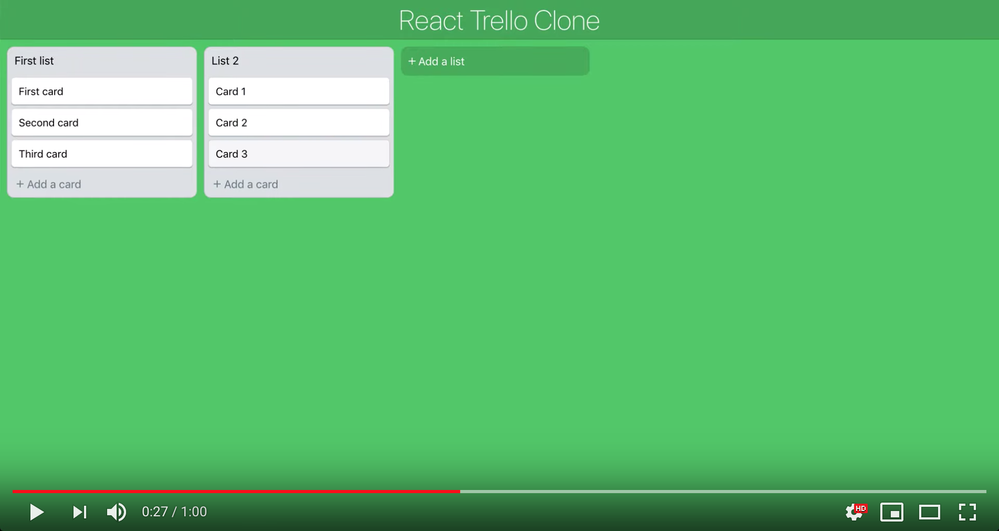

# Build a Trello clone with React and Redux 
 
In this tutorial we'll build a Trello clone with React and Redux. You can try the final result at [https://react-trello-clone.netlify.com](https://react-trello-clone.netlify.com) and see it in the following video:


[](https://youtu.be/YQEJbcB96Q8 "Video")


------

## Create React App

Let's create our project with [Create React App](https://github.com/facebook/create-react-app)

Run:
```bash
npx create-react-app trello-clone
cd trello-clone
```

And open the code in your favorite editor.

------

## Dependencies

In this tutorial we'll use:
- [redux](https://redux.js.org): to manage the global state of the app
- [react-textarea-autosize](https://github.com/andreypopp/react-textarea-autosize): a react component that will render a textarea that resizes itself when needed
- [react-beautiful-dnd](https://github.com/atlassian/react-beautiful-dnd): A beautiful library to implement drag and drop functionalities
- [lodash.throttle](https://www.npmjs.com/package/lodash.throttle): to prevent too many calls of a function
- [shortid](https://github.com/dylang/shortid): to generate unique ids. 

```bash
npm install --save redux react-redux \
react-beautiful-dnd react-textarea-autosize \
lodash.throttle shortid
```

------

## Start

Start the app with the following command:

```bash
npm start
```

Every time you change your code the app wil be reloaded automatically.

------

## Index.html

Change the title in the file `public/index.html` from `<title>React App</title>` to `<title>React Trello Clone</title>`

And insert before the closing tag `</body>` the following snippets that let us embed the beautiful and free icons of [Ionicons](https://ionicons.com):

```html
<script src="https://unpkg.com/ionicons@4.5.5/dist/ionicons.js"></script>
```

------

## Cleanup and structure

Create the folders `components` and `styles` and move the files `App.js` and `App.css`:

```shell
mkdir src/components src/styles
mv src/App.js src/components/App.js
mv src/App.css src/styles/App.css
```

Now your project structure should be:

```
.
├── README.md
├── package-lock.json
├── package.json
├── public
│   ├── favicon.ico
│   ├── index.html
│   └── manifest.json
└── src
    ├── components
    │   └── App.js
    ├── index.css
    ├── index.js
    ├── serviceWorker.js
    └── styles
        └── App.css
```

In `src/index.js` update the import of the component App:

```js
import App from './components/App';
```

and in `src/components/App.js` adjust the import of the styles:

```js
import "../styles/App.css";
```

------

## App.js

To give the app the green color of Trello and make a simple header,
replace the content of `src/components/App.js` with

```javascript
import "../styles/App.css";

import React, { Component } from "react";

class App extends Component {
  render() {
    return (
      <div className="App">
        <div className="Header">React Trello Clone</div>
      </div>
    );
  }
}

export default App;
```

and the content of `src/components/App.css` with:

```css
.App {
  background: rgb(75, 191, 107);
  height: 100vh;
}

.Header {
  background: rgba(0, 0, 0, 0.15);
  color: white;
  padding: 5px 0;
  border-bottom: 1px solid rgba(0, 0, 0, 0.12);
  text-align: center;
  font-size: 40px;
  font-weight: 200;
}
```

Delete unused files:

```shell
rm src/App.test.js src/logo.svg
```

------

## Board reducer

Redux it's all about [reducers](https://redux.js.org/basics/reducers), so let's start to create them.

We'll have only one board with many lists of cards, we represent the board with an array of lists ids.

Here the reducer of the board that let us add, move (for the drag and drop) and delete a list id from the array.

`src/store.js`

```javascript
const board = (state = { lists: [] }, action) => {
  switch (action.type) {
    case "ADD_LIST": {
      const { listId } = action.payload;
      return { lists: [...state.lists, listId] };
    }
    case "MOVE_LIST": {
      const { oldListIndex, newListIndex } = action.payload;
      const newLists = Array.from(state.lists);
      const [removedList] = newLists.splice(oldListIndex, 1);
      newLists.splice(newListIndex, 0, removedList);
      return { lists: newLists };
    }
    case "DELETE_LIST": {
      const { listId } = action.payload;
      const filterDeleted = tmpListId => tmpListId !== listId;
      const newLists = state.lists.filter(filterDeleted);
      return { lists: newLists };
    }
    default:
      return state;
  }
};
```

------

## Lists reducer

Create the `listsById` reducer where we store the lists in an object where the keys are the ids of the lists, so that we can access the details of individual lists. Each list will have an `_id`, a title and an array of card ids. We have actions to add a list, change its tile, delete it, add a card, move a card (for the drag and drop) and delete a card.

`src/store.js`

```js
const listsById = (state = {}, action) => {
  switch (action.type) {
    case "ADD_LIST": {
      const { listId, listTitle } = action.payload;
      return {
        ...state,
        [listId]: { _id: listId, title: listTitle, cards: [] }
      };
    }
    case "CHANGE_LIST_TITLE": {
      const { listId, listTitle } = action.payload;
      return {
        ...state,
        [listId]: { ...state[listId], title: listTitle }
      };
    }
    case "DELETE_LIST": {
      const { listId } = action.payload;
      const { [listId]: deletedList, ...restOfLists } = state;
      return restOfLists;
    }
    case "ADD_CARD": {
      const { listId, cardId } = action.payload;
      return {
        ...state,
        [listId]: { ...state[listId], cards: [...state[listId].cards, cardId] }
      };
    }
    case "MOVE_CARD": {
      const {
        oldCardIndex,
        newCardIndex,
        sourceListId,
        destListId
      } = action.payload;
      // Move within the same list
      if (sourceListId === destListId) {
        const newCards = Array.from(state[sourceListId].cards);
        const [removedCard] = newCards.splice(oldCardIndex, 1);
        newCards.splice(newCardIndex, 0, removedCard);
        return {
          ...state,
          [sourceListId]: { ...state[sourceListId], cards: newCards }
        };
      }
      // Move card from one list to another
      const sourceCards = Array.from(state[sourceListId].cards);
      const [removedCard] = sourceCards.splice(oldCardIndex, 1);
      const destinationCards = Array.from(state[destListId].cards);
      destinationCards.splice(newCardIndex, 0, removedCard);
      return {
        ...state,
        [sourceListId]: { ...state[sourceListId], cards: sourceCards },
        [destListId]: { ...state[destListId], cards: destinationCards }
      };
    }
    case "DELETE_CARD": {
      const { cardId: deletedCardId, listId } = action.payload;
      const filterDeleted = cardId => cardId !== deletedCardId;
      return {
        ...state,
        [listId]: {
          ...state[listId],
          cards: state[listId].cards.filter(filterDeleted)
        }
      };
    }
    default:
      return state;
  }
};
```

------

## Cards reducer

The last reducer is the one for the cards. As for the lists we have an object where the keys are the cards ids and we have action to add a card, change its title and delete it. We also capture the action `DELETE_LIST` to delete every card of a list to be deleted.

`src/store.js`

```javascript
const cardsById = (state = {}, action) => {
  switch (action.type) {
    case "ADD_CARD": {
      const { cardText, cardId } = action.payload;
      return { ...state, [cardId]: { text: cardText, _id: cardId } };
    }
    case "CHANGE_CARD_TEXT": {
      const { cardText, cardId } = action.payload;
      return { ...state, [cardId]: { ...state[cardId], text: cardText } };
    }
    case "DELETE_CARD": {
      const { cardId } = action.payload;
      const { [cardId]: deletedCard, ...restOfCards } = state;
      return restOfCards;
    }
    // Find every card from the deleted list and remove it
    case "DELETE_LIST": {
      const { cards: cardIds } = action.payload;
      return Object.keys(state)
        .filter(cardId => !cardIds.includes(cardId))
        .reduce(
          (newState, cardId) => ({ ...newState, [cardId]: state[cardId] }),
          {}
        );
    }
    default:
      return state;
  }
};
```

------

## Create and persists store

With our reducers in place we can create the store. Let's also persist the store so that your lists and cards are not discarded each time. To save the state we subscribe to store changes with `store.subscribe`, we call `store.getState()` to get the current state, we serialize it to JSON and we save it in the localStorage. Then when the app loads we read the state from the localStorage, deserialize it and create the store.

`src/store.js`

```javascript
import { combineReducers, createStore } from "redux";
import throttle from "lodash.throttle";
```

```javascript
const reducers = combineReducers({
  board,
  listsById,
  cardsById
});

const saveState = state => {
  try {
    const serializedState = JSON.stringify(state);
    localStorage.setItem("state", serializedState);
  } catch {
    // ignore write errors
  }
};

const loadState = () => {
  try {
    const serializedState = localStorage.getItem("state");
    if (serializedState === null) {
      return undefined;
    }
    return JSON.parse(serializedState);
  } catch (err) {
    return undefined;
  }
};

const persistedState = loadState();
const store = createStore(reducers, persistedState);

store.subscribe(
  throttle(() => {
    saveState(store.getState());
  }, 1000)
);

export default store;

```

------

## Import store

Import the store in the `index.js` and wrap the App component with the Redux Provider.

`src/index.js`

```js
import React from "react";
import ReactDOM from "react-dom";

import App from "./components/App";

import { Provider } from "react-redux";
import store from "./store";

import * as serviceWorker from "./serviceWorker";

import "./index.css";

const rootElement = document.getElementById("root");
ReactDOM.render(
  <Provider store={store}>
    <App />
  </Provider>,
  rootElement
);

// If you want your app to work offline and load faster, you can change
// unregister() to register() below. Note this comes with some pitfalls.
// Learn more about service workers: https://bit.ly/CRA-PWA
serviceWorker.unregister();
```

------

## Seed data

We can start to insert some data, create a file called `seed.js` and dispatch some actions to create 2 lists with 2 cards each.

`src/seed.js`

```js
import shortid from "shortid";

export default store => {
  console.log("Insert first list");
  const firstListId = shortid.generate();

  store.dispatch({
    type: "ADD_LIST",
    payload: { listId: firstListId, listTitle: "First list" }
  });

  store.dispatch({
    type: "ADD_CARD",
    payload: {
      listId: firstListId,
      cardId: shortid.generate(),
      cardText: "First card"
    }
  });

  store.dispatch({
    type: "ADD_CARD",
    payload: {
      listId: firstListId,
      cardId: shortid.generate(),
      cardText: "Second card"
    }
  });

  console.log("Insert second list");
  const secondListId = shortid.generate();

  store.dispatch({
    type: "ADD_LIST",
    payload: { listId: secondListId, listTitle: "Second list" }
  });

  store.dispatch({
    type: "ADD_CARD",
    payload: {
      listId: secondListId,
      cardId: shortid.generate(),
      cardText: "Card 1"
    }
  });

  store.dispatch({
    type: "ADD_CARD",
    payload: {
      listId: secondListId,
      cardId: shortid.generate(),
      cardText: "Card 2"
    }
  });
};
```

In the store file launch the seed if the persisted state is empty.

`src/store.js`

```js
import seed from "./seed";

//...

console.log(store.getState());
if (!store.getState().board.lists.length) {
  console.log("SEED");
  seed(store);
}

export default store;
```

------

## Show the board

Let's start to visualize the board. We'll take a top-down approach, we import the components required and then write them.

Here we import the Board component that will display the lists, but we'll have an error since we don't have it yet.

`src/components/App.js`

```js
import Board from "./Board";
```

```js
<Board />
```

------

## Board component

Create the board component, it connects to Redux to retrieve the stored board and display all its lists with a List component that we create in the next step.

`src/components/Board.js`

```js
import "../styles/Board.css";

import React, { Component } from "react";
import { connect } from "react-redux";

import List from "./List";

class Board extends Component {
  render() {
    const { board } = this.props;

    return (
      <div className="Board">
        {board.lists.map((listId, index) => {
          return <List listId={listId} key={listId} index={index} />;
        })}
      </div>
    );
  }
}

const mapStateToProps = state => ({ board: state.board });

export default connect(mapStateToProps)(Board);
```

`src/styles/Board.css`

```css
.Board {
  height: 92%;
  display: flex;
  overflow-x: auto;
}
```

------

## List component

The list component receive the `listId` from the board and retrieve the list details from the Redux store. It display the title of the list and the array of cards with a Card component.

`src/components/List.js`

```js
import "../styles/List.css";

import React, { Component } from "react";
import { connect } from "react-redux";

import Card from "./Card";

class List extends Component {
  render() {
    const { list } = this.props;

    return (
      <div className="List">
        <div className="List-Title" onClick={this.toggleEditingTitle}>
          {list.title}
        </div>

        {list.cards &&
          list.cards.map((cardId, index) => (
            <Card
              key={cardId}
              cardId={cardId}
              index={index}
              listId={list._id}
            />
          ))}
      </div>
    );
  }
}

const mapStateToProps = (state, ownProps) => ({
  list: state.listsById[ownProps.listId]
});

export default connect(mapStateToProps)(List);
```


`src/styles/List.css`

```css
.List {
  background: #dfe3e6;
  flex-shrink: 0;
  width: 272px;
  height: fit-content;
  margin: 10px;
  margin-right: 0;
  border-radius: 10px;
  border: 1px solid rgba(0, 0, 0, 0.12);
}

.List-Title {
  cursor: pointer;
  padding: 10px;
  overflow-wrap: break-word;
}
```

------

## Card component

The last component to remove the errors and finally visualize our data is the Card component. It is quite simple, it retrieve the card detail from the store and display the card text in a styled div.

`src/components/Card.js`

```js
import "../styles/Card.css";

import React, { Component } from "react";
import { connect } from "react-redux";

class Card extends Component {
  render() {
    const { card } = this.props;

    return <div className="Card">{card.text}</div>;
  }
}

const mapStateToProps = (state, ownProps) => ({
  card: state.cardsById[ownProps.cardId]
});

export default connect(mapStateToProps)(Card);
```


`src/styles/Card.css`

```css
.Card {
  position: relative;
  cursor: pointer;
  background: white;
  margin: 5px;
  padding: 10px;
  border-radius: 5px;
  border: 1px solid rgba(0, 0, 0, 0.12);
  box-shadow: 0 1px 0 rgba(9, 45, 66, 0.25);
  font-size: 15px;
  overflow-wrap: break-word;
  min-height: 18px;
}

.Card:hover {
  background: #f5f6f7;
}
```

Now you should be able to see the board! 🚀🚀

------

## Add a card

Now that we can visualize our data, let's start to add the functionalities to manipulate it. First thing we want to be able to add a card.

Create a button in the List component that, like the original Trello, bring us a new empty card to edit. To do this we need a state to know if the user is adding a card and a function to change this state. Then we need the component `CardEditor` that let the user edit the text of the new card. And finally the function `addCard` that dispatch an action to create the card in the store.

`src/components/List.js`

```js
import CardEditor from "./CardEditor";

import shortid from "shortid";
```

```js
state = {
  addingCard: false
};

toggleAddingCard = () =>
  this.setState({ addingCard: !this.state.addingCard });

addCard = async cardText => {
  const { listId, dispatch } = this.props;

  this.toggleAddingCard();

  const cardId = shortid.generate();

  dispatch({
    type: "ADD_CARD",
    payload: { cardText, cardId, listId }
  });
};
```

The following snippet is for the `render` function, we choose if we display the Editor or the button depending on the state.

```js
const { addingCard } = this.state;

//...

{addingCard ? (
  <CardEditor
    onSave={this.addCard}
    onCancel={this.toggleAddingCard}
    adding
  />
) : (
  <div className="Toggle-Add-Card" onClick={this.toggleAddingCard}>
    <ion-icon name="add" /> Add a card
  </div>
)}

```

`src/styles/List.css`

```css
.Toggle-Add-Card {
  cursor: pointer;
  padding: 10px;
  color: #6b808c;
  border-radius: 0 0 10px 10px;
  display: flex;
  align-items: center;
}

.Toggle-Add-Card:hover {
  background-color: rgba(9, 45, 66, 0.13);
  color: #17394d;
  text-decoration: underline;
}

.Toggle-Add-Card ion-icon {
  margin-right: 2px;
}
```

------

## CardEditor component

To make it working we need the CardEditor. Here we use the `react-textarea-autosize` component that we installed earlier. We have a state with our text and a function to change it. The parent will pass as prop the `onSave` function that we call when the user press Enter or click the save button. The save and cancel buttons are in the EditButtons component that we'll create in the next step. As you can see we expect also `onDelete` prop that will only be used for editing a card.

`src/components/CardEditor.js`

```js
import "../styles/CardEditor.css";

import React, { Component } from "react";
import TextareaAutosize from "react-textarea-autosize";
import EditButtons from "./EditButtons";

class CardEditor extends Component {
  state = {
    text: this.props.text || ""
  };

  handleChangeText = event => this.setState({ text: event.target.value });

  onEnter = e => {
    const { text } = this.state;

    if (e.keyCode === 13) {
      e.preventDefault();
      this.props.onSave(text);
    }
  };

  render() {
    const { text } = this.state;
    const { onSave, onCancel, onDelete, adding } = this.props;

    return (
      <div className="Edit-Card">
        <div className="Card">
          <TextareaAutosize
            autoFocus
            className="Edit-Card-Textarea"
            placeholder="Enter the text for this card..."
            value={text}
            onChange={this.handleChangeText}
            onKeyDown={this.onEnter}
          />
        </div>
        <EditButtons
          handleSave={() => onSave(text)}
          saveLabel={adding ? "Add card" : "Save"}
          handleDelete={onDelete}
          handleCancel={onCancel}
        />
      </div>
    );
  }
}

export default CardEditor;
```

`src/styles/CardEditor.css`

```css
.Edit-Card .Card {
  min-height: 50px;
  padding-left: 8px;
  padding-right: 15px;
}

.Edit-Card .Card:hover {
  background: white;
}

.Edit-Card-Textarea {
  width: 100%;
  border: none;
  resize: none;
  outline: none;
  font-size: 15px;
}
```

------

## EditButtons component

The EditButtons component is quite simple, it takes as props the edit functions and render the buttons, it's a stateless component.

`src/components/EditButtons.js`

```js
import "../styles/EditButtons.css";

import React from "react";

const EditButtons = ({ handleSave, saveLabel, handleDelete, handleCancel }) => (
  <div className="Edit-Buttons">
    <div
      tabIndex="0"
      className="Edit-Button"
      style={{ backgroundColor: "#5aac44" }}
      onClick={handleSave}
    >
      {saveLabel}
    </div>
    {handleDelete && (
      <div
        tabIndex="0"
        className="Edit-Button"
        style={{ backgroundColor: "#EA2525", marginLeft: 0 }}
        onClick={handleDelete}
      >
        Delete
      </div>
    )}
    <div tabIndex="0" className="Edit-Button-Cancel" onClick={handleCancel}>
      <ion-icon name="close" />
    </div>
  </div>
);

export default EditButtons;
```

`src/styles/EditButtons.css`

```css
.Edit-Buttons {
  display: flex;
}

.Edit-Button {
  cursor: pointer;
  box-shadow: 0 1px 0 0 #3f6f21;
  width: fit-content;
  margin: 0 5px 10px;
  padding: 6px 12px;
  border-radius: 5px;
  color: white;
  font-weight: 700;
  outline: none;
}

.Edit-Button:hover {
  opacity: 0.7;
}

.Edit-Button-Cancel {
  cursor: pointer;
  margin-bottom: 10px;
  display: flex;
  align-items: center;
  font-size: 20px;
  opacity: 0.5;
  outline: none;
}

.Edit-Button-Cancel:hover {
  opacity: 1;
}
```

And with that you should be able to add a new card to the lists 💪

------

## Edit and delete a card

The original Trello when you hover on a card, it will show an edit icon that if clicked brings you to the CardEditor, let's do this. In the Card component we need two state properties to know if the user is hovering on the card and if he's editing it. Then to edit and delete a card we need two functions to dispatch the actions. In the `render` function we decide if we render the card text or the card editor depending on the `editing` property of the state, that will be changed by the user clicking on the edit icon. With the CardEditor component already in place our task is easier this time.

`src/components/Card.js`

```js
import CardEditor from "./CardEditor";
```

```js
state = {
  hover: false,
  editing: false
};

startHover = () => this.setState({ hover: true });
endHover = () => this.setState({ hover: false });

startEditing = () =>
  this.setState({
    hover: false,
    editing: true,
    text: this.props.card.text
  });

endEditing = () => this.setState({ hover: false, editing: false });

editCard = async text => {
  const { card, dispatch } = this.props;

  this.endEditing();

  dispatch({
    type: "CHANGE_CARD_TEXT",
    payload: { cardId: card._id, cardText: text }
  });
};

deleteCard = async () => {
  const { listId, card, dispatch } = this.props;

  dispatch({
    type: "DELETE_CARD",
    payload: { cardId: card._id, listId }
  });
};
```

```js
render() {
  const { card } = this.props;
  const { hover, editing } = this.state;

  if (!editing) {
    return (
      <div
        className="Card"
        onMouseEnter={this.startHover}
        onMouseLeave={this.endHover}
      >
        {hover && (
          <div className="Card-Icons">
            <div className="Card-Icon" onClick={this.startEditing}>
              <ion-icon name="create" />
            </div>
          </div>
        )}
        {card.text}
      </div>
    );
  } else {
    return (
      <CardEditor
        text={card.text}
        onSave={this.editCard}
        onDelete={this.deleteCard}
        onCancel={this.endEditing}
      />
    );
  }
}
```

`src/styles/Card.css`

```css
.Card-Icons {
  position: absolute;
  top: 5px;
  right: 5px;
  display: flex;
  flex-direction: row;
  justify-content: flex-end;
}

.Card-Icon {
  cursor: pointer;
  width: 24px;
  height: 24px;
  display: flex;
  align-items: center;
  justify-content: center;
  border-radius: 5px;
  margin: 1px;
  color: rgba(0, 0, 0, 0.5);
  background: #f5f6f7;
  opacity: 0.9;
}

.Card-Icon:hover {
  opacity: 1;
  background: rgba(220, 220, 220, 1);
}
```

------

## Add a list

Let's move on to adding a list. In the board component we create a button that will start the process and then in the next step we create the component `AddList` that manage the list creation.

`src/components/Board.js`

```js
import AddList from "./AddList";
```

```js
state = {
  addingList: false
};

toggleAddingList = () =>
  this.setState({ addingList: !this.state.addingList });
```

```js
const { addingList } = this.state;

//...

<div className="Add-List">
  {addingList ? (
    <AddList toggleAddingList={this.toggleAddingList} />
  ) : (
    <div onClick={this.toggleAddingList} className="Add-List-Button">
      <ion-icon name="add" /> Add a list
    </div>
  )}
</div>
```

`src/components/Board.css`

```css
.Add-List {
  width: 272px;
  margin: 10px;
  flex-shrink: 0;
}

.Add-List-Button {
  background-color: rgba(0, 0, 0, 0.12);
  border-radius: 10px;
  cursor: pointer;
  color: #fff;
  display: flex;
  align-items: center;
  min-height: 32px;
  padding: 5px 8px;
  transition: background-color 85ms ease-in, opacity 40ms ease-in,
    border-color 85ms ease-in;
  height: fit-content;
}

.Add-List-Button:hover {
  background-color: rgba(0, 0, 0, 0.24);
}

.Add-List-Button ion-icon {
  margin-right: 1px;
}
```

------

## AddList component

The AddList component will render a textarea for the list title and the buttons to save it. It uses the ListEditor component (that we'll build in the next step), the EditButtons component and the `createList` function to dispatch the `ADD_LIST` action.

`src/components/AddList.js`

```js
import "../styles/AddList.css";

import React, { Component } from "react";
import { connect } from "react-redux";
import ListEditor from "./ListEditor";
import shortid from "shortid";
import EditButtons from "./EditButtons";

class AddList extends Component {
  state = {
    title: ""
  };

  handleChangeTitle = e => this.setState({ title: e.target.value });

  createList = async () => {
    const { title } = this.state;
    const { dispatch } = this.props;

    this.props.toggleAddingList();

    dispatch({
      type: "ADD_LIST",
      payload: { listId: shortid.generate(), listTitle: title }
    });
  };

  render() {
    const { toggleAddingList } = this.props;
    const { title } = this.state;

    return (
      <div className="Add-List-Editor">
        <ListEditor
          title={title}
          handleChangeTitle={this.handleChangeTitle}
          onClickOutside={toggleAddingList}
          saveList={this.createList}
        />

        <EditButtons
          handleSave={this.createList}
          saveLabel={"Add list"}
          handleCancel={toggleAddingList}
        />
      </div>
    );
  }
}

export default connect()(AddList);
```

`src/styles/AddList.css`

```css
.Add-List-Editor {
  background: #dfe3e6;
  border-radius: 5px;
  padding: 2px 2px;
}
```

------

## ListEditor component

The ListEditor component is composed of a textarea and an optional delete icon for when we want to delete a list. A thing to notice here is that if the user click outside we'll call the function `onClickOutside` passed with the props, we achive this by adding an event listener for the click and detect if the target of the event is this component or not. As for the CardEditor, we let the user save by pressing Enter.

`src/components/ListEditor.js`

```js
import "../styles/ListEditor.css";

import React, { Component } from "react";
import TextareaAutosize from "react-textarea-autosize";

class ListEditor extends Component {
  ref = React.createRef();

  onEnter = e => {
    if (e.keyCode === 13) {
      e.preventDefault();
      this.props.saveList();
    }
  };

  handleClick = e => {
    const node = this.ref.current;

    if (node.contains(e.target)) {
      return;
    }

    this.props.onClickOutside();
  };

  componentDidMount() {
    document.addEventListener("click", this.handleClick, false);
  }

  componentWillUnmount() {
    document.removeEventListener("click", this.handleClick, false);
  }

  render() {
    const { title, handleChangeTitle, deleteList } = this.props;

    return (
      <div className="List-Title-Edit" ref={this.ref}>
        <TextareaAutosize
          autoFocus
          className="List-Title-Textarea"
          placeholder="Enter list title..."
          value={title}
          onChange={handleChangeTitle}
          onKeyDown={this.onEnter}
          style={{ width: deleteList ? 220 : 245 }}
        />
        {deleteList && <ion-icon name="trash" onClick={deleteList} />}
      </div>
    );
  }
}

export default ListEditor;
```

`src/styles/ListEditor.css`

```css
.List-Title-Edit {
  display: flex;
  align-items: center;
}

.List-Title-Edit ion-icon {
  cursor: pointer;
  padding: 2px;
  margin: 1px 3px;
  font-size: 23px;
  border-radius: 5px;
  color: rgba(0, 0, 0, 0.5);
}

.List-Title-Edit ion-icon:hover {
  background: rgba(211, 211, 211, 1);
}

.List-Title-Textarea {
  margin: 6px 0 5px 6px;
  border-radius: 3px;
  border: none;
  resize: none;
  outline: none;
  font-size: 15px;
  padding: 5px;
}

.List-Title-Textarea:focus {
  box-shadow: inset 0 0 0 2px #0079bf;
}
```

Now you should be able to add a list 💎

------

## Edit and delete a list

Let's implement the editing and deleting of a list. It is similar to what we've done for a card, we have the state property `editingTitle`, a function to change it, a function to dispatch the edit action, an action for the delete function and then the render function is modified to display the editor.

`src/components/List.js`

```js
import ListEditor from "./ListEditor";
```

```js
state = {
  editingTitle: false,
  title: this.props.list.title,
  addingCard: false
};
```

```js
toggleEditingTitle = () =>
  this.setState({ editingTitle: !this.state.editingTitle });

handleChangeTitle = e => this.setState({ title: e.target.value });

editListTitle = async () => {
  const { listId, dispatch } = this.props;
  const { title } = this.state;

  this.toggleEditingTitle();

  dispatch({
    type: "CHANGE_LIST_TITLE",
    payload: { listId, listTitle: title }
  });
};

deleteList = async () => {
  const { listId, list, dispatch } = this.props;

  dispatch({
    type: "DELETE_LIST",
    payload: { listId, cards: list.cards }
  });
};
```

In the render function we choose whether to show the editor or the title based on the state:

```js
const { editingTitle, addingCard, title } = this.state;

//...

{editingTitle ? (
  <ListEditor
    list={list}
    title={title}
    handleChangeTitle={this.handleChangeTitle}
    saveList={this.editListTitle}
    onClickOutside={this.editListTitle}
    deleteList={this.deleteList}
  />
) : (
  <div className="List-Title" onClick={this.toggleEditingTitle}>
    {list.title}
  </div>
)}
```

------

## Move lists around

Now we'll start to build the coolest feature of Trello: the drag and drop. To implement it we use the library [react-beautiful-dnd](https://github.com/atlassian/react-beautiful-dnd) that is very well done and easy to use. First we have to make a surface droppable, in our case is the board. We use the `DragDropContext` component to specify the general context in which drag and drop will take place, it needs the prop `onDragEnd`: a callback function that will be called after the drag ends, we'll dispatch the action `MOVE_LIST` that change the order of the list in the board reducer. Then we wrap all the content of the board with the `Droppable` component that specify where the dropping can happens.

`src/components/Board.js`

```js
import { DragDropContext, Droppable } from "react-beautiful-dnd";
```

```js
handleDragEnd = ({ source, destination, type }) => {
  // dropped outside the allowed zones
  if (!destination) return;

  const { dispatch } = this.props;

  // Move list
  if (type === "COLUMN") {
    // Prevent update if nothing has changed
    if (source.index !== destination.index) {
      dispatch({
        type: "MOVE_LIST",
        payload: {
          oldListIndex: source.index,
          newListIndex: destination.index
        }
      });
    }
    return;
  }
};
```

```js
render() {
  const { board } = this.props;
  const { addingList } = this.state;

  return (
    <DragDropContext onDragEnd={this.handleDragEnd}>
      <Droppable droppableId="board" direction="horizontal" type="COLUMN">
        {(provided, _snapshot) => (
          <div className="Board" ref={provided.innerRef}>
            {board.lists.map((listId, index) => {
              return <List listId={listId} key={listId} index={index} />;
            })}

            {provided.placeholder}

            <div className="Add-List">
              {addingList ? (
                <AddList toggleAddingList={this.toggleAddingList} />
              ) : (
                <div
                  onClick={this.toggleAddingList}
                  className="Add-List-Button"
                >
                  <ion-icon name="add" /> Add a list
                </div>
              )}
            </div>
          </div>
        )}
      </Droppable>
    </DragDropContext>
  );
}
```

Then we need to make the lists draggable, we import the `Draggable` component:

`src/components/List.js`

```js
import { Draggable } from "react-beautiful-dnd";
```

and in the `render` funcion we wrap all the content of the list with it:

```js
const { list, index } = this.props;

//...

<Draggable draggableId={list._id} index={index}>
  {(provided, snapshot) => (
    <div
      ref={provided.innerRef}
      {...provided.draggableProps}
      {...provided.dragHandleProps}
      className="List"
    >

		//...

    </div>
  )}
</Draggable>

```

------

## Move cards around

To move also the cards the process is similar. We add to the `handleDragEnd` in the Board component the following snippet that dispatch the action `MOVE_CARD`:

`src/components/Board.js`

```js
// Move card
if (
  source.index !== destination.index ||
  source.droppableId !== destination.droppableId
) {
  dispatch({
    type: "MOVE_CARD",
    payload: {
      sourceListId: source.droppableId,
      destListId: destination.droppableId,
      oldCardIndex: source.index,
      newCardIndex: destination.index
    }
  });
}
```

Then we wrap the rendering of the array of cards in the List component with the component `Droppable`

`src/components/List.js`

```js
import { Droppable, Draggable } from "react-beautiful-dnd";
```

```js
render() {

//..

<Droppable droppableId={list._id}>
  {(provided, _snapshot) => (
    <div ref={provided.innerRef}>
      {list.cards &&
        list.cards.map((cardId, index) => (
          <Card
            key={cardId}
            cardId={cardId}
            index={index}
            listId={list._id}
          />
        ))}

      {provided.placeholder}
    </div>
  )}
</Droppable>

//..

}
```

And we make the Card component draggable

`src/components/Card.js`

```js
import { Draggable } from "react-beautiful-dnd";
```

by wrapping it with the Draggable component

```js
const { card, index } = this.props;

//...

if (!editing) {
  return (
    <Draggable draggableId={card._id} index={index}>
      {(provided, snapshot) => (
        <div
          ref={provided.innerRef}
          {...provided.draggableProps}
          {...provided.dragHandleProps}
          className="Card"
          onMouseEnter={this.startHover}
          onMouseLeave={this.endHover}
        >
          {hover && (
            <div className="Card-Icons">
              <div className="Card-Icon" onClick={this.startEditing}>
                <ion-icon name="create" />
              </div>
            </div>
          )}

          {card.text}
        </div>
      )}
    </Draggable>
  );
} else {

//...
```

------

And this is the end, I hope you enjoyed this tutorial 🙏

------

